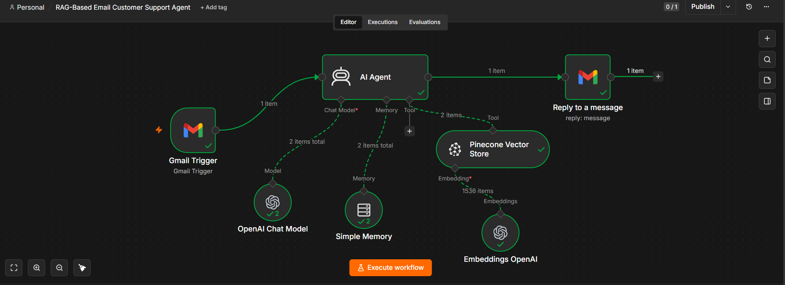

# RAG-Based Email Customer Support Agent

### 1. System Workflow

The automated customer support system operates through the following sequence:

* Trigger: When a customer sends an inquiry to the dedicated support email address, the Gmail Trigger node instantly captures the message.
* AI Analysis: The incoming email payload is passed directly to the AI Agent, which analyzes the customer's intent.
* RAG \& Retrieval: The agent utilizes the Pinecone Vector Store tool to query the company knowledge base for relevant context matching the inquiry.
* Response Generation: Powered by the OpenAI Chat Model and maintained context via Simple Memory, a precise, context-aware, and professional response is formulated.
* Delivery: Finally, the Gmail (Reply to a message) node automatically sends the generated response back to the customer within the correct email thread.

### 2. Tool & Platform Selection

This project leverages a modern and robust technology stack:

* n8n: A visual low-code automation platform used to orchestrate and connect the entire workflow seamlessly.
* Gmail API: Used to monitor incoming customer queries and dispatch automated replies.
* OpenAI API \& Chat Model (GPT): Serves as the primary core reasoning engine to understand user messages and generate intelligent text.
* OpenAI Embeddings: Converts raw company knowledge text into high-dimensional vector representations.
* Pinecone: A cloud-native vector database optimized for storing and performing similarity searches on the company's knowledge base.

### 3. Email Processing

* Received: Incoming customer emails are captured in real-time by the email trigger node.
* Processed: Essential email components such as the sender address, subject line, message body, and unique thread/message IDs are parsed.
* Prepared for AI Analysis: The parsed text is structured into a clean format tailored for the AI agent to comprehend the core inquiry effortlessly.

### 4. Information Retrieval (RAG)

* Knowledge Base: Comprehensive documentation including company policies, shipping schedules, refund guidelines, and product information.
* Embeddings \& Vector Database: Text chunks are transformed into vector embeddings using OpenAI models and stored inside Pinecone.
* Similarity Search: When an email arrives, the system executes a semantic similarity search against the vector database to retrieve the exact documentation snippet needed to answer the query.

### 5. Response Generation & Delivery

* Generation: The retrieved context is fed alongside the customer's prompt into the OpenAI language model, producing a polite, accurate, and professional response.
* Delivery: The Gmail node utilizes the original message ID to reply directly inside the existing customer email thread.

### 6. Real-World Use Cases

* E-commerce Customer Support: Instantly answering questions regarding order tracking, return policies, and shipping durations.
* SaaS Product Support: Resolving technical inquiries, troubleshooting common software bugs, or guiding users through feature documentation.
* Educational Platforms: Providing automated answers regarding course enrollment, fee structures, and class schedules.

### 7. Challenges & Limitations

* Hallucinations: The LLM may occasionally extrapolate or generate inaccurate information not present in the verified knowledge base.
* Outdated Knowledge Base: If company policies change and the vector store (Pinecone) is not updated, the agent will continue serving outdated information.
* Complex Customer Queries: Highly nuanced, multi-part, or emotionally charged customer complaints may fail to resolve properly via automated text.
* API Costs: High volumes of incoming emails and continuous embedding generation can scale up OpenAI and Pinecone API consumption costs.

### 8. Workflow Architecture Diagram

[Gmail Trigger] 
       │
       ▼
   [AI Agent] ◄───► [OpenAI Chat Model]
       │       ◄───► [Simple Memory]
       │       ◄───► [Pinecone Vector Store (Tool)] ───> [Embeddings OpenAI]
       ▼
[Gmail: Reply to a message] ───> [Customer Inbox]

## 🖼️ Workflow Screenshot

